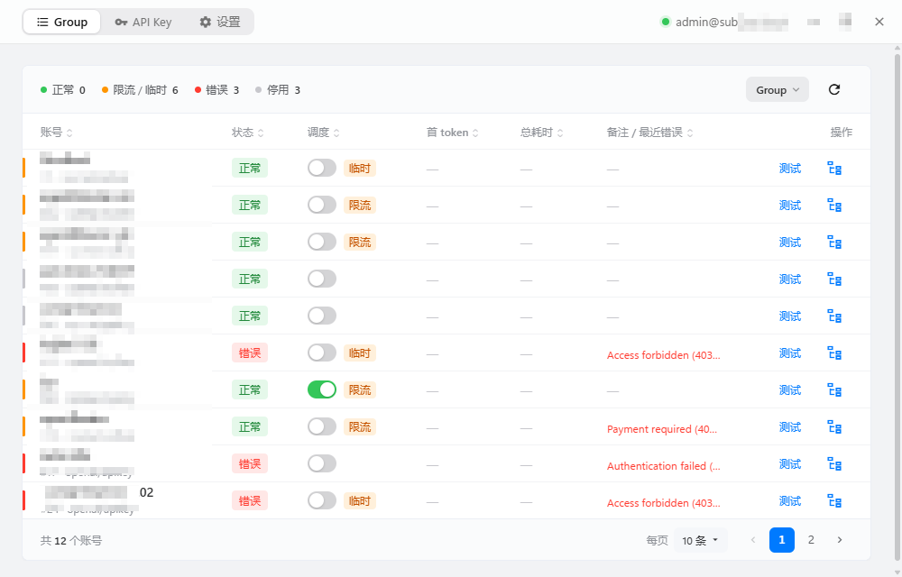
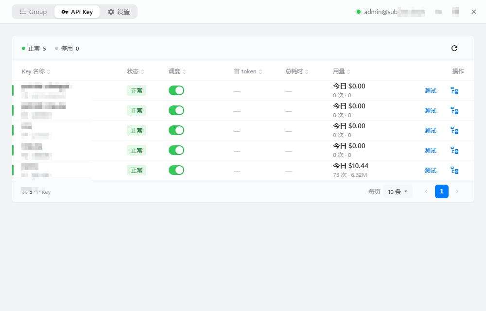

# s2akit

[](https://github.com/ke4nec/s2akit/releases)
[](https://github.com/ke4nec/s2akit/releases)
[](https://github.com/ke4nec/s2akit/actions)
[](./LICENSE)

给自己搭了 [sub2api](https://github.com/Wei-Shaw/sub2api) 中转服务器做桌面端管理的小工具，切换测试账号避免登录网页操作：
在电脑上管理账号和 API Key，一键真实测速、切换可用账号，顺手看每天的用量。

典型场景：codex 只绑 1 个 Key，分组里一堆同类账号哪个稳全靠猜——用它逐个真实测一遍，
按首字快慢排序，点一下就把最快的启用。




## 准备工作

- 一台跑着 sub2api 的服务器（本地或远程都行）+ 管理员账号
- Windows / macOS（Apple Silicon）/ Linux 都能用，安装包去 GitHub Releases 下载：
  Windows 分安装版和绿色版，macOS 是 dmg，Linux 是 deb / rpm / AppImage

## 上手三步

1. 打开「设置」页，填 sub2api 地址，填管理员邮箱密码，保存并登录（账号开了二步验证的话，再输一次验证码）
2. 到「Group」页，顶部选目标分组（会自动记住）
3. 点某行的「测试」，看首 token 耗时，顺眼的点调度开关启用——完事

## 日常用法

**主窗口**
- **Group 页**：表格一眼看全组账号状态（正常/限流/错误/停用），点表头按耗时排序；
  行右键可以选模型测、启停账号，行内「调度」列的开关也能直接启停
- **API Key 页**：和 Group 页长一个样。每行直接看到今天花了多少钱、跑了多少 token，
  悬停看明细（请求次数、输入/输出/缓存 token、缓存率、平均 token/次、费用）；
  行右键“查看额度”可把某把 Key 设为默认，托盘顶部的用量就只算它（再点恢复看全部）
- 关窗口不会退出，藏到托盘；标题栏空白处可拖动，双击空白最大化

**托盘图标**
- 左键：显示 / 隐藏主窗口
- 右键菜单：顶部 `Group | Key` 切换两套列表
  - 组里：第一行是当前分组（点开换组），下面是账号，悬停或点一下弹出操作（选模型测、启停）
  - Key 里：key 列表，同样的悬停操作（选模型测、启停、查看额度）
  - 右上角是今天的用量，点击强制刷新一次；底部有刷新和退出

**更新**：启动后自动检查新版本，有更新会弹窗问你，后台下载好、校验通过再确认安装重启。

## 数据放哪了

- 地址、分组选择、上次测试用的模型、托盘偏好都存在本机配置：`%APPDATA%/com.niq.s2akit/config.json`；
  重启用保存的账号自动重新登录（登录 token 只存内存，不落盘）
- 注意配置里有**明文**邮箱密码，电脑别借人，属于单人本机场景自己评估

## 常见情况

- 测速失败：看行里的红色备注，401/402/429/502 这类都是上游原样返回的，按码排查
- 用量看着不对：点一下托盘菜单右上角的用量区，强制刷一次即时值
- 托盘图标找不到：Windows 把它收进任务栏溢出区（托盘箭头里）了，拖出来就行

## 开发

```bash
npm install
npm run tauri dev    # 开发调试
npm run tauri build  # 打包（输出 src-tauri/target/release/bundle/）
```

技术栈：Tauri 2 + Vue 3 + TypeScript + Vuetify 4（Rust 后端）。提问题直接贴报错文本和复现步骤即可。
